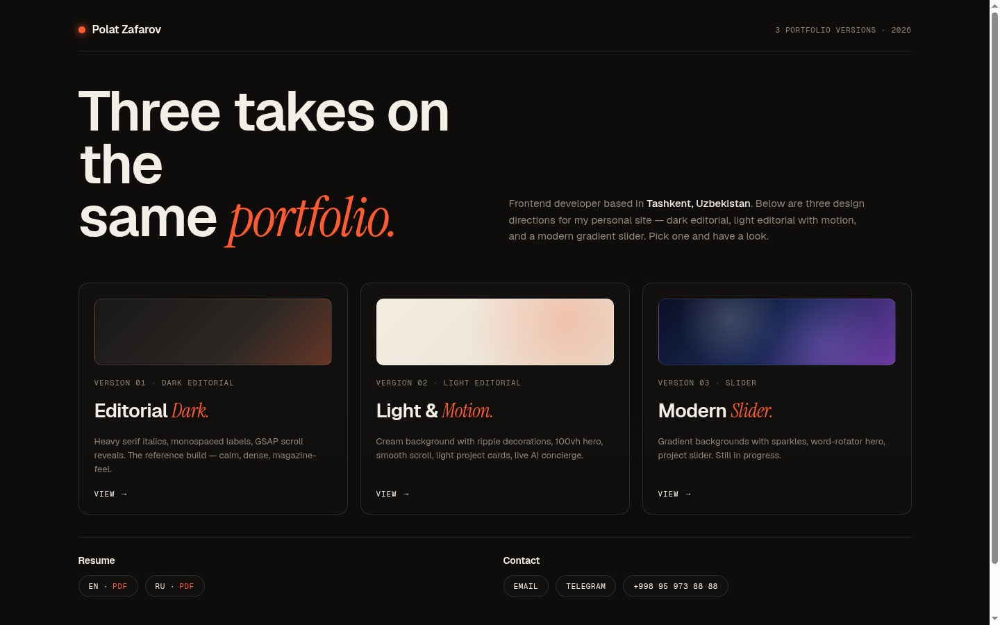
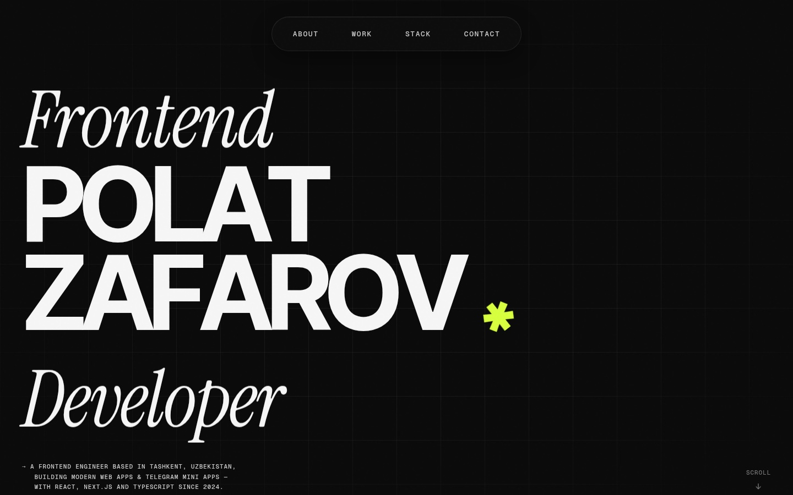
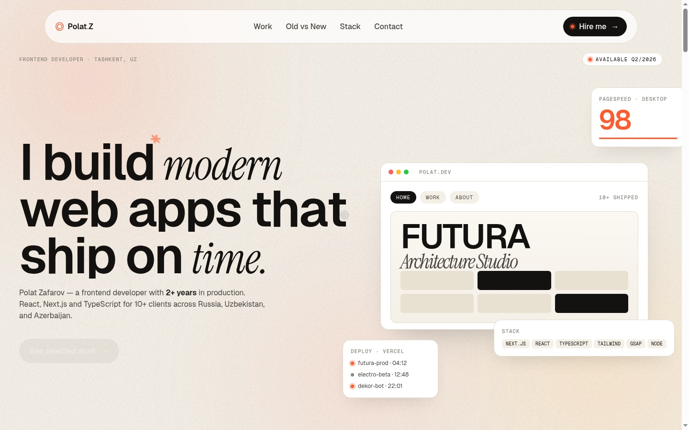

# ✦ Polat Zafarov — Portfolio

> Three design directions for my personal portfolio — dark editorial, light editorial with motion, and a modern gradient slider.

---

## Versions

### V1 · Editorial Dark ⭐

> The reference build. Heavy serif italics, monospaced labels, GSAP scroll reveals, custom cursor, lime (#D4FF3A) accent.

| Feature | Details |
|---|---|
| **Intro** | Cinematic curtain reveal |
| **Projects** | 5 case studies with CSS browser mockups |
| **AI Chat** | Live "Polat.AI" concierge (Gemini 2.5 Flash Lite) |
| **Stack** | Animated progress bars + tech table |
| **Tweaks** | User-controlled cursor, grid, BPM panel |

**[→ View V1](https://zafarovpolat.github.io/portfolio/v1/)**

---

### V2 · Light & Motion

> Cream background, soft blobs, floating browser mockup, "Old vs New" comparison section.

**[→ View V2](https://zafarovpolat.github.io/portfolio/v2/)**

---

### V3 · Modern Slider _(in progress)_

> Gradient backgrounds (blue→purple), sparkles, word-rotator hero, dashboard mockup, FAQ accordion.

**[→ View V3](https://zafarovpolat.github.io/portfolio/v3/)**

---

## Tech Stack

- HTML5 / CSS3 / Vanilla JavaScript (ES6+)
- GSAP 3.12.5 + ScrollTrigger
- Google Gemini 2.5 Flash Lite — live AI concierge
- GitHub Pages — hosting

## Contact

- **Email:** atuin59354081@gmail.com
- **Telegram:** [@zafarovpolat](https://t.me/zafarovpolat)
- **Resume:** [EN (PDF)](uploads/resume.pdf) · [RU (PDF)](uploads/zafarov.pdf)
